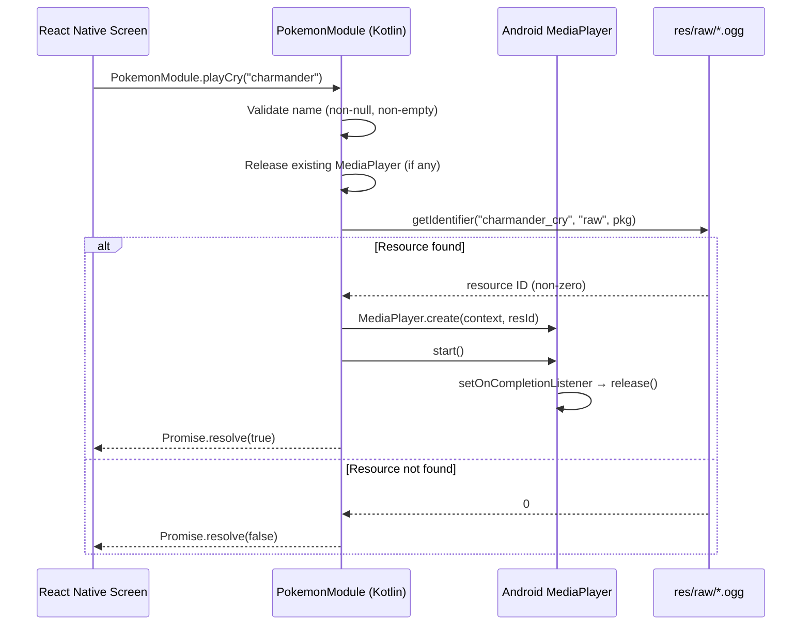

# Design Document: Pokemon Cry Playback

## Overview

This feature adds Pokémon cry audio playback across the app by exposing the existing Android `MediaPlayer`-based cry logic to React Native. The `PokemonOverlayService` already has a working `playCry()` method that resolves `{pokemon}_cry` from `res/raw/` — this design extends that pattern into `PokemonModule` as a new `@ReactMethod`, then wires it into HomeScreen (grid tap), CryScreen (on mount when hatched), and LockScreen (sprite tap).

All 251 `.ogg` cry files (Gen 1 + Gen 2) already exist in `pokemon-screen/android/app/src/main/res/raw/`. No JS-side audio library is needed — playback is fully native.

## Architecture



The architecture is intentionally simple — a single new method on the existing native module, no new services or classes. The `PokemonModule` manages its own `MediaPlayer` instance independently from the one in `PokemonOverlayService` (they serve different trigger paths: overlay taps vs. RN screen taps).

### Design Decisions

1. **Separate MediaPlayer instance in PokemonModule** — The overlay service already has its own `MediaPlayer` for tap-on-overlay cries. Adding a second instance in `PokemonModule` avoids coupling the two and prevents race conditions when both could trigger simultaneously. If both fire at once, both play (which is acceptable — it's a short sound effect).

2. **Promise-based return** — Returns `true`/`false` rather than rejecting the promise on missing files. This keeps the JS side simple (no try/catch needed for expected cases like missing cries) and matches the "graceful degradation" requirement.

3. **No JS audio library** — Since all cry files are Android raw resources and `MediaPlayer` is already proven in the overlay service, adding `expo-av` or `react-native-sound` would be unnecessary complexity.

4. **Lowercase name convention** — Pokémon names are already stored lowercase with underscores in SharedPreferences and in the `POKE_IDS` map. The `playCry` method lowercases the input and appends `_cry` to match the file naming convention (`{name}_cry.ogg`).

## Components and Interfaces

### Kotlin Native Module: `PokemonModule.playCry`

```kotlin
// New method added to existing PokemonModule.kt
@ReactMethod
fun playCry(pokemonName: String?, promise: Promise) {
    // 1. Validate input
    if (pokemonName.isNullOrBlank()) {
        promise.resolve(false)
        return
    }

    // 2. Build resource identifier
    val name = pokemonName.lowercase()
    val resId = reactApplicationContext.resources.getIdentifier(
        "${name}_cry", "raw", reactApplicationContext.packageName
    )

    // 3. Handle missing resource
    if (resId == 0) {
        promise.resolve(false)
        return
    }

    // 4. Release previous player
    try {
        mediaPlayer?.release()
        mediaPlayer = null
    } catch (e: Exception) { /* ignore */ }

    // 5. Create and play
    try {
        mediaPlayer = MediaPlayer.create(reactApplicationContext, resId)
        mediaPlayer?.setOnCompletionListener { mp ->
            mp.release()
            if (mediaPlayer === mp) mediaPlayer = null
        }
        mediaPlayer?.start()
        promise.resolve(true)
    } catch (e: Exception) {
        mediaPlayer?.release()
        mediaPlayer = null
        promise.resolve(false)
    }
}
```

A `private var mediaPlayer: MediaPlayer? = null` field is added to the class.

### React Native Interface

```typescript
// Usage from any screen — no wrapper needed
import { NativeModules } from 'react-native';
const { PokemonModule } = NativeModules;

// Fire-and-forget (most common)
PokemonModule.playCry("totodile");

// Or await the result if needed
const played: boolean = await PokemonModule.playCry("totodile");
```

### Screen Integration Points

| Screen | Trigger | Condition | Call |
|---|---|---|---|
| HomeScreen | Grid item `onPress` | `isOwned === true` | `PokemonModule.playCry(item)` alongside existing `switchPokemon` |
| CryScreen | `useEffect` on mount | `stats.isHatched === true` | `PokemonModule.playCry(stats.selectedPokemon)` |
| LockScreen | Totodile sprite tap | Always (sprite is always the current Pokémon) | `PokemonModule.playCry(currentPokemon)` |

### Totodile Component Changes

The `Totodile` component needs to accept an `onPress` callback prop. It will be wrapped in a `TouchableOpacity` (or `Pressable`) to capture taps. The parent `LockScreen` passes the cry trigger as the callback.

```typescript
interface TotodileProps {
  bottom?: number;
  duration?: number;
  size?: number;
  paused?: boolean;
  onPress?: () => void;  // NEW
}
```

## Data Models

No new data models or storage changes. The feature uses:

- **Existing SharedPreferences** (`pokemon_prefs`): reads `selectedPokemon` and `{name}_isHatched` — no writes needed
- **Existing `res/raw/` resources**: 251 `{name}_cry.ogg` files already present
- **Existing `POKE_IDS` map** (JS side): used to determine ownership, not modified

### Resource Naming Convention

| Pokémon | SharedPrefs key | Cry resource ID | File |
|---|---|---|---|
| Charmander | `charmander` | `charmander_cry` | `charmander_cry.ogg` |
| Mr. Mime | `mr_mime` | `mr_mime_cry` | `mr_mime_cry.ogg` |
| Ho-Oh | `ho_oh` | `ho_oh_cry` | `ho_oh_cry.ogg` |
| Nidoran♀ | `nidoran_f` | `nidoran_f_cry` | `nidoran_f_cry.ogg` |


## Correctness Properties

*A property is a characteristic or behavior that should hold true across all valid executions of a system — essentially, a formal statement about what the system should do. Properties serve as the bridge between human-readable specifications and machine-verifiable correctness guarantees.*

### Property 1: Valid name resolves correct resource and returns true

*For any* valid Pokémon name from the POKE_IDS mapping, calling `playCry` SHALL construct the resource identifier as `"{lowercase_name}_cry"`, initiate MediaPlayer playback with that resource, and resolve the promise with `true`.

**Validates: Requirements 1.1, 1.4, 5.1, 5.2, 5.3**

### Property 2: Sequential cries release previous MediaPlayer

*For any* pair of valid Pokémon names (A, B), calling `playCry(A)` followed by `playCry(B)` SHALL release the MediaPlayer instance created for A before creating the MediaPlayer instance for B.

**Validates: Requirements 1.2**

### Property 3: Missing resource resolves false with no audio

*For any* string that does not correspond to a valid cry resource in `res/raw/`, calling `playCry` SHALL resolve the promise with `false` and SHALL NOT create a MediaPlayer instance.

**Validates: Requirements 1.3**

### Property 4: Completion releases MediaPlayer resources

*For any* valid Pokémon name where playback succeeds, when the MediaPlayer's `onCompletionListener` fires, the MediaPlayer SHALL be released and the internal reference SHALL be set to null.

**Validates: Requirements 1.5**

### Property 5: Null or blank input resolves false without playback

*For any* null, empty, or whitespace-only string, calling `playCry` SHALL resolve the promise with `false` without attempting resource resolution or MediaPlayer creation.

**Validates: Requirements 6.2**

### Property 6: Errors during playback result in graceful cleanup

*For any* Pokémon name where MediaPlayer initialization or playback throws an exception, `playCry` SHALL catch the exception, release any partially initialized MediaPlayer resources, and resolve the promise with `false`.

**Validates: Requirements 6.1, 6.3**

## Error Handling

| Scenario | Behavior | Promise Result |
|---|---|---|
| `pokemonName` is null or blank | Return immediately, no audio | `false` |
| Resource identifier resolves to 0 (no file) | Return, no MediaPlayer created | `false` |
| `MediaPlayer.create()` throws exception | Catch, release partial resources | `false` |
| `MediaPlayer.start()` throws exception | Catch, release player | `false` |
| Previous cry still playing when new cry requested | Release old player, then play new | New cry's result |
| Playback completes normally | `onCompletionListener` releases player | (already resolved `true`) |

All error paths resolve the promise (never reject) to keep the JS side simple. The app never crashes due to cry playback failures — audio is a non-critical enhancement.

## Testing Strategy

### Property-Based Tests (Kotlin/JVM)

Use **Kotest** with its property-based testing module (`kotest-property`) for the `PokemonModule.playCry` logic. Kotest is the standard PBT library for Kotlin and integrates well with JUnit.

Each property test runs a minimum of **100 iterations** with generated inputs.

**Test configuration:**
- Library: `io.kotest:kotest-property:5.x`
- Runner: JUnit 5 via `kotest-runner-junit5`
- Mocking: `mockk` for MediaPlayer and Android Context
- Tag format: `Feature: pokemon-cry-playback, Property {N}: {title}`

**Property tests to implement:**
1. Property 1 — Generate random names from POKE_IDS keys, verify resource ID construction and promise resolution
2. Property 2 — Generate random name pairs, verify release-before-create sequence
3. Property 3 — Generate random strings NOT in POKE_IDS, verify false resolution
4. Property 4 — Generate random valid names, simulate completion callback, verify release
5. Property 5 — Generate null/empty/whitespace strings, verify false without resource lookup
6. Property 6 — Generate valid names + simulate exceptions, verify cleanup and false

### Unit Tests (Example-Based)

For the React Native screen integration (JS side), use example-based tests since these are UI wiring checks:

- HomeScreen: tap owned Pokémon → `playCry` + `switchPokemon` both called
- HomeScreen: tap unowned Pokémon → `playCry` NOT called
- CryScreen: mount with hatched Pokémon → `playCry` called on mount
- CryScreen: mount with egg → `playCry` NOT called
- LockScreen: tap Totodile sprite → `playCry` called

### Manual Smoke Tests

- Play cry for a Pokémon with a known `.ogg` file (e.g., totodile)
- Rapid-tap to verify sequential release works (no overlapping audio glitches)
- Test with a name that has no cry file to verify silent failure
